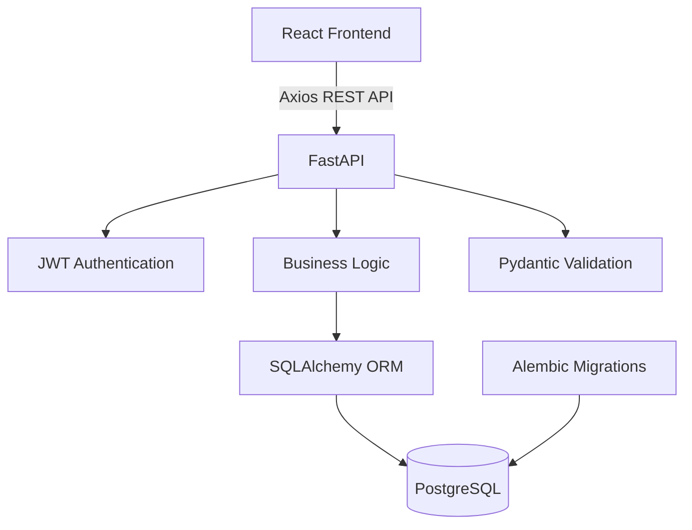
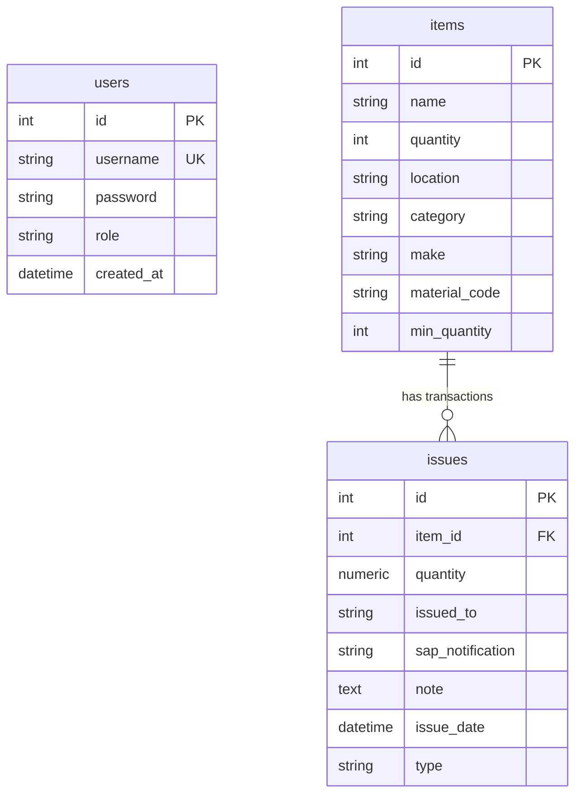

# StockSphere – Inventory Management System

StockSphere is a modern, high-performance, full-stack inventory management system designed for tracking spare parts, components, consumables, and raw materials. It provides real-time stock levels, granular filters, issue/replenish tracking, security protocols, and dashboard metrics.

---

## Key Highlights (Architectural & Design Choices)

- ⚡ **N+1 Query Prevention**: Implemented SQLAlchemy eager-loading relations using `joinedload` on issue histories, optimizing relational lookups into single database queries and preventing round-trip latency.
- ⚙️ **Performance-Optimized Database Indexes**: Configured database indexes on frequently-queried columns (`item_id` and `issue_date`), speeding up history lists, order-by queries, and relational joins.
- 🧪 **Robust Transactional Test Suite**: Created a fully transactional unit test suite using isolated sqlite session rollbacks to ensure complete side-effect test isolation and prevent database state leakage.
- 🛡️ **Defensive API Rate Limiting**: Added `slowapi` brute-force protections to the user authentication login endpoint (`POST /api/auth/login`) limiting requests dynamically by remote client IP address.
- 🌐 **Modern Lifespan Resource Management**: Switched backend event orchestration from deprecated FastAPI handlers to modern async `lifespan` context manager patterns, improving startup performance and resource cleanup.
- 🔒 **Secure Data Schemas**: Set strict min/max boundary validators across all Pydantic request models (e.g. username length checks, password constraints) validating inputs at the gateway.

---

## Features

- 📦 **Inventory Management (CRUD)**: Create, read, update, and delete inventory items (restricted to Admins).
- 📈 **Real-Time Dashboard**: Header metrics indicating total unique items, active low-stock alerts, and aggregate quantities issued.
- 🔄 **Stock Flow Tracking (Issues/Replenish)**: Double-entry-style stock adjustment flow. Deducts stock during issues (validating availability) and adds stock during replenishments, tracking who and when made the request.
- 🔍 **Filtering and Search**: Full-text style search matching names, categories, makes, material codes, or locations, paired with paginated tables.
- 🔐 **Role-Based Access Control (RBAC)**: Strict API routing dependencies restricting write permissions to administrative credentials while allowing standard read-only + issue action roles to guest/basic users.
- 📊 **CSV Report Export**: Easily export current inventory lists to standard CSV files directly from the user interface.
- 📜 **API Documentation**: Automated documentation via OpenAPI/Swagger UI.

---

## Tech Stack

### Frontend
- **Framework**: React.js (v19) - Built using functional components, state management hooks (`useState`, `useEffect`), and error boundaries.
- **Styling**: Custom Premium Vanilla CSS design system featuring curated palettes, Outfit/Inter typography, glassmorphism layouts, micro-animations, and complete responsive design.
- **API Client**: Axios - Integrated with an instances helper client for path mappings, base URL configurations, and request proxying.

### Backend
- **Framework**: FastAPI - High-performance asynchronous Python web framework providing automatic Swagger UI/ReDoc OpenAPI documentation.
- **Database ORM**: SQLAlchemy 2.0 - Declarative mapping style utilizing session management, eager relations (`joinedload`), and transaction rollbacks.
- **Data Validation & Settings**: Pydantic v2 & `pydantic-settings` - Robust input/output schemas with static validation constraints and dynamic `.env` configuration mapping.
- **Database Migrations**: Alembic - Complete schema migration tracking with autogenerated migrations and upgrade scripts.
- **Testing**: Pytest & `pytest-asyncio` - Extensive transactional testing coverage using isolated in-memory SQLite instances.

### Security & Utilities
- **Hashing & Authentication**: bcrypt & python-jose - Strong password hashing using salt rounds alongside JSON Web Tokens (JWT) for secure authentication.
- **Rate Limiting**: slowapi - Rate limiting middleware applied selectively (e.g. `5 requests/minute` on auth endpoints) to prevent brute-force attacks.
- **Task Runner**: concurrently - Development tool orchestration starting frontend Npm servers and backend Uvicorn processes simultaneously.

---

## Architecture

StockSphere uses a clean, decoupling architecture separating the visual presentation client from the transactional API layer:



---

## Database Schema



### Table Definitions

1. **`users`**: Manages credential hashing and roles (`admin`, `user`).
2. **`items`**: Tracks core inventory parameters, storage locations, minimum quantity thresholds, and current stock status.
3. **`issues`**: Logs historical stock flows (type `ISSUE` or `REPLENISH`). Includes index-optimized foreign keys to the `items` table.
   
Note: StockSphere uses PostgreSQL as the main database for application runtime, and uses SQLite for local isolated unit testing (`pytest`).

---

## Project Structure

```
stocksphere/
├── frontend/               # React app (Create React App)
├── backend/                # FastAPI backend (official)
│   ├── app/
│   │   ├── main.py         # App entry point, CORS, startup seeding
│   │   ├── models.py       # SQLAlchemy ORM models
│   │   ├── schemas.py      # Pydantic request/response schemas
│   │   ├── database.py     # DB engine & session factory
│   │   ├── auth.py         # JWT helpers, password hashing
│   │   ├── config.py       # Settings (reads from .env)
│   │   ├── logger.py       # Centralised logging
│   │   └── routers/
│   │       ├── auth.py     # POST /api/auth/login|register
│   │       ├── items.py    # CRUD + search/filter  /api/items
│   │       ├── issues.py   # Issue/replenish transactions  /api/issues
│   │       └── dashboard.py# Stats  /api/dashboard/stats
│   ├── alembic/            # DB migration scripts
│   ├── tests/              # Pytest test suite
│   └── requirements.txt
├── package.json            # Root scripts (concurrently)
└── .gitignore
```

---

## Prerequisites

| Tool | Version |
|------|---------|
| Python | 3.12+ |
| Node.js | 18+ |
| npm | 9+ |

---

## Setup & Installation

### 1. Backend

```bash
cd backend

# Create & activate virtual environment (first time only)
python -m venv venv
venv312\Scripts\activate        # Windows
# source venv312/bin/activate   # macOS / Linux

# Install dependencies
pip install -r requirements.txt

# Configure environment
copy .env.example .env          # then edit DATABASE_URL and JWT_SECRET
```

### 2. Frontend

```bash
cd frontend
npm install
```

---

## Running Locally

From the **project root**, start both servers concurrently with a single command:

```bash
npm start
```

This runs:
- **React dev server** → [http://localhost:3000](http://localhost:3000)
- **FastAPI backend** → [http://localhost:5000](http://localhost:5000)
- **Swagger UI (API docs)** → [http://localhost:5000/docs](http://localhost:5000/docs)

---

## Default Credentials

| Username | Password | Role  |
|----------|----------|-------|
| `admin`  | `vectra` | admin |

> Seeded automatically on backend startup if the database is empty.

---

## Running Tests

Run backend tests:
```bash
npm run test-backend
```

Or directly using pytest inside the virtual environment:
```bash
cd backend
venv\Scripts\python -m pytest tests/ -v
```

---

## API Overview

### Authentication
| Method | Endpoint | Description |
|--------|----------|-------------|
| POST | `/api/auth/login` | Returns a signed JWT token and user role |
| POST | `/api/auth/register` | Registers a new user with standard permissions |

### Inventory Items
| Method | Endpoint | Auth | Description |
|--------|----------|------|-------------|
| GET | `/api/items` | — | Paginated, filterable & searchable item list |
| POST | `/api/items` | Admin | Create a new inventory item |
| PUT | `/api/items/{id}` | Admin | Update item fields |
| DELETE | `/api/items/{id}` | Admin | Delete item (cascades to transactions) |
| GET | `/api/items/locations` | — | Retrieve distinct active locations |
| GET | `/api/items/categories` | — | Retrieve distinct active categories |

### Stock Transactions
| Method | Endpoint | Auth | Description |
|--------|----------|------|-------------|
| GET | `/api/issues` | — | Paginated transaction history (newest first) |
| POST | `/api/issues` | — | Issue stock (deducts qty) or Replenish stock (adds qty) |
| PUT | `/api/issues/{id}` | — | Adjust a past transaction quantity |
| DELETE | `/api/issues/{id}` | — | Remove transaction logs |

### Dashboard Metrics
| Method | Endpoint | Auth | Description |
|--------|----------|------|-------------|
| GET | `/api/dashboard/stats` | — | Summary numbers for UI stat cards |

Full interactive API documentation is available at `/docs` (Swagger UI) or `/redoc` (ReDoc) of the running backend server.

---

## Deployment

### Containerization (Docker)
Create a production container layout:

1. **Backend Dockerfile** (`backend/Dockerfile`):
   ```dockerfile
   FROM python:3.12-slim
   WORKDIR /app
   COPY requirements.txt .
   RUN pip install --no-cache-dir -r requirements.txt
   COPY . .
   EXPOSE 5000
   CMD ["uvicorn", "app.main:app", "--host", "0.0.0.0", "--port", "5000"]
   ```

2. **Frontend Dockerfile** (`frontend/Dockerfile`):
   ```dockerfile
   FROM node:18-alpine as build
   WORKDIR /app
   COPY package*.json ./
   RUN npm install
   COPY . .
   RUN npm run build

   FROM nginx:alpine
   COPY --from=build /app/build /usr/share/nginx/html
   EXPOSE 80
   CMD ["nginx", "-g", "daemon off;"]
   ```

---

## Future Improvements

1. **HttpOnly Cookie Auth Session Management**: Switch from insecure `localStorage` storage to secure `httpOnly` secure cookies.
2. **Material Reorder Automated Alerts**: Automate email notifications to administrators when stock levels drop below the defined `min_quantity` thresholds.
3. **Audit Log History**: Implement soft deletes and audit tables tracking details of every query action (deletes, updates) for compliance.

---

## License

This project is licensed under the MIT License - see the [LICENSE](LICENSE) file for details.
